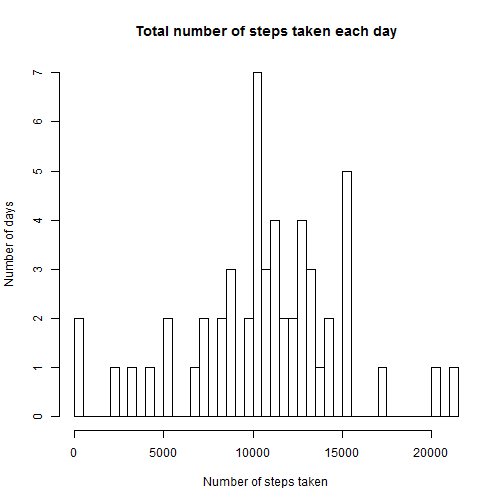
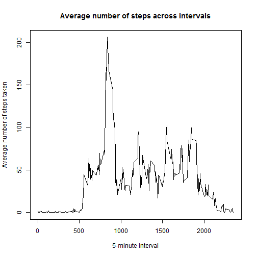
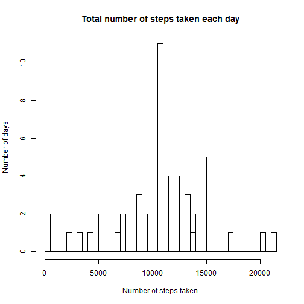
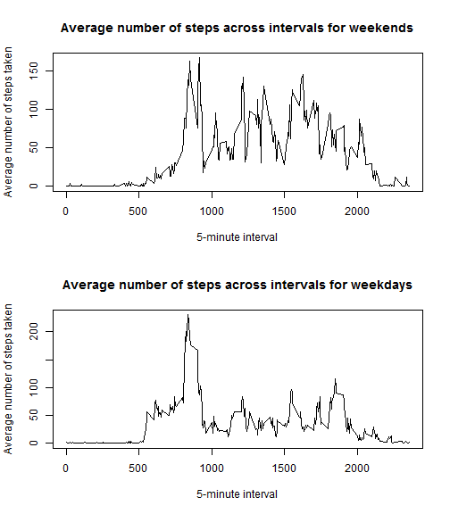

# Reproducible Research: Peer Assessment 1

This report details the analysis of a dataset collected using a personal activity monitoring device. The data consist of two months of observations for an anonymous individual collected during the months of October and November, 2012, and include the number of steps taken in 5-minute intervals each day.

## Loading the data

We first load the data into R. The following assumes that the unzipped data file, activity.csv, is in the working directory.


```r
activity <- read.csv("activity.csv")
```

We do not perform further preprocessing of the data at this point.

## Summary of total number of steps taken per day

Below we summarize the data by calculating the total number of steps taken per day, making use of the plyr package, and plotting a corresponding histogram. Sums that are equal to NA due to missing values are not included in the plot.


```r
library(plyr)
steps.by.date <- ddply(activity, .(date), summarize, steps = sum(steps))
hist(steps.by.date$steps, breaks = 35,
     main = "Total number of steps taken each day",
     xlab = "Number of steps taken", ylab = "Number of days")
```

 

Ignoring missing values, the mean and median number of steps taken each day (to the nearest integer) are 10766 and 10765, respectively, as calculated below.


```r
mean(steps.by.date$steps, na.rm = TRUE)
```

```
## [1] 10766
```

```r
median(steps.by.date$steps, na.rm = TRUE)
```

```
## [1] 10765
```

## Average daily activity pattern

We summarize the daily activity pattern by making a time series plot of the average number of steps taken (averaged across all days) versus the 5-minute interval.


```r
avg.steps.by.interval <- ddply(activity, .(interval),
                               summarize, avg.steps = mean(steps, na.rm = TRUE))
plot(avg.steps.by.interval$interval, avg.steps.by.interval$avg.steps, type="l",
     main = "Average number of steps across intervals",
     xlab = "5-minute interval", ylab = "Average number of steps taken")
```

 

On average, the 5-minute interval that contains the maximum number of steps is the interval between 8:35 AM and 8:40 AM.


```r
avg.steps.by.interval$interval[which.max(avg.steps.by.interval$avg.steps)]
```

```
## [1] 835
```

## Imputing missing values

There is a total of 2304 missing values in the dataset.


```r
sum(is.na(activity$steps))
```

```
## [1] 2304
```

We impute the missing values using the means of the corresponding 5-minute intervals. In other words, if the number of steps for an interval is NA, it is replaced by the average number of steps, taken across all days, for that interval. A new dataset with the missing values filled in is created, as shown below.


```r
activity.new <- activity
for (i in 1:nrow(activity))
{
  if (is.na(activity[i, 1]))
    activity.new[i, 1] <-
      avg.steps.by.interval$avg.steps[match(activity[i, 3],
                                            avg.steps.by.interval$interval)]
}
```

A histogram of the total number of steps taken each day for this new, imputed dataset is shown below.


```r
steps.by.date.new <- ddply(activity.new, .(date), summarize, steps = sum(steps))
hist(steps.by.date.new$steps, breaks = 35,
     main = "Total number of steps taken each day",
     xlab = "Number of steps taken", ylab = "Number of days")
```

 

The mean and median number of steps taken each day (to the nearest integer) for the imputed dataset are both 10766. The mean is unchanged relative to that of the unimputed dataset, while the median has increased by 1.


```r
mean(steps.by.date.new$steps)
```

```
## [1] 10766
```

```r
median(steps.by.date.new$steps)
```

```
## [1] 10766
```

## Differences in activity patterns between weekdays and weekends

We create a new factor variable with two levels - "weekday" and "weekend", indicating whether a given date is a weekday or weekend day. This new variable is appended to the imputed dataset.


```r
weekend.strings <- c("Saturday", "Sunday")
activity.new$weekday.weekend <-
  ifelse(weekdays(as.Date(activity.new$date)) %in% weekend.strings,
         "weekend",
         "weekday")
activity.new$weekday.weekend <- as.factor(activity.new$weekday.weekend)
```

Below are time series plots of the average number of steps taken versus the 5-minute interval, averaged across weekdays and weekends.


```r
steps.by.int.new <- ddply(activity.new, .(interval, weekday.weekend),
                          summarize, avg.steps = mean(steps))
par(mfrow = c(2, 1))
plot(steps.by.int.new$interval[steps.by.int.new$weekday.weekend == "weekend"],
     steps.by.int.new$avg.steps[steps.by.int.new$weekday.weekend == "weekend"],
     type="l",
     main = "Average number of steps across intervals for weekends",
     xlab = "5-minute interval",
     ylab = "Average number of steps taken")
plot(steps.by.int.new$interval[steps.by.int.new$weekday.weekend == "weekday"],
     steps.by.int.new$avg.steps[steps.by.int.new$weekday.weekend == "weekday"],
     type="l",
     main = "Average number of steps across intervals for weekdays",
     xlab = "5-minute interval",
     ylab = "Average number of steps taken")
```

 
